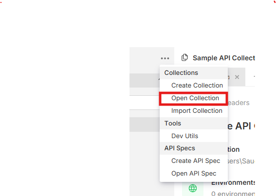
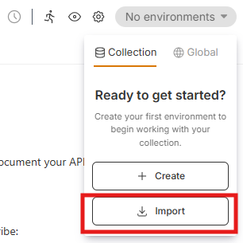

# API Requests for Data Exchange

This document provides information about API requests for the Data Exchange.

## Roles
- Data Consumer - Alice
- Data Provider - Bob

## Bruno

The Bruno collection contains all the data exchange flow between Alice and Bob.

### Setting Up Bruno

[Download](https://www.usebruno.com/downloads) Bruno client suitable for your operating system

### Import Collection

- Open the following [Collection](./constructx-edc) in Bruno using the dots at the left top corner.

### Import Envrionments

Once the collection is imported, import the [Environment](./environments.json) at the top right corner,

The collection is adopted from [Eclipse-TractusX Umbrella - API Testing](https://github.com/eclipse-tractusx/tractus-x-umbrella/tree/release-25.09/docs/api) 

## NOTICE

This work is licensed under the [Apache-2.0](https://www.apache.org/licenses/LICENSE-2.0).

* SPDX-License-Identifier: Apache-2.0
* SPDX-FileCopyrightText: 2024 Contributors to the Eclipse Foundation
* Source URL: <https://github.com/eclipse-tractusx/tractus-x-umbrella>